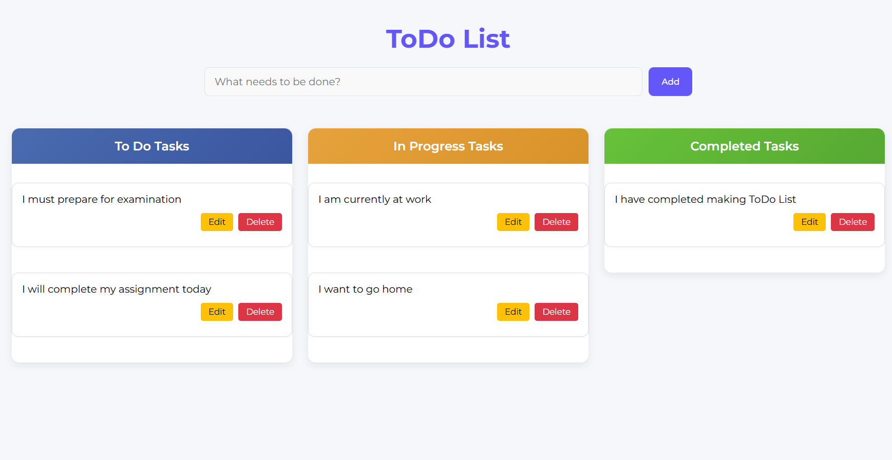
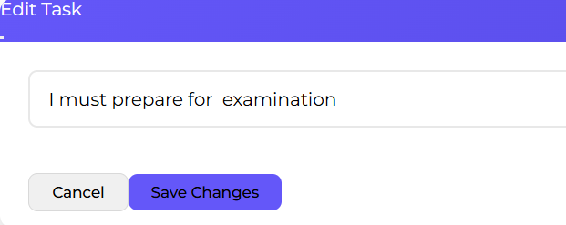
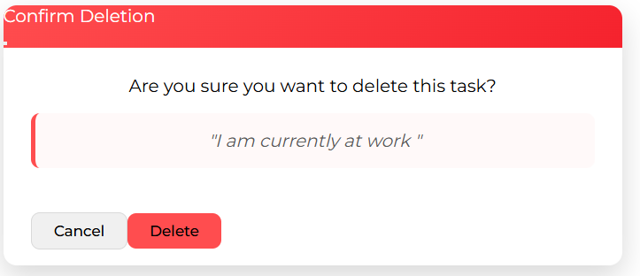

# 📝 To-Do List Application

*A responsive ToDo application with beautiful UI and intuitive drag-and-drop functionality*

  

---

# ✨ Features

- ✨ **Drag-and-Drop Interface** - Organize tasks between "To Do", "In Progress", and "Done"

- 📱 **Fully Responsive** - Works flawlessly on mobile, tablet, and desktop

- 💾 **Local Storage** - Tasks persist even after page refresh

- ✅ **Edit/Delete Tasks** - With confirmation dialogs

- 🌈 **Modern UI** - Clean design with smooth animations

---

## 📸 🛠️ Technologies Used

| Technology | Purpose |
|---------|-----------|
| **React 18** | Frontend framework |
| **Bootstrap 5** | UI components and styling |
| **React Bootstrap** | Pre-built React components |
| **localStorage** | Data persistence |
| **CSS3** | Custom styling and animations |
| **React + Vite** | Ultra-fast development environment |


---

# 🚀 Quick Start

1. **Clone the repository:**
   ```bash
   git clone https://github.com/BinayRajThapa/Advance-ToDo-List.git

2. **Install dependencies:**
   ```bash
    npm install
    
3. **Run the development server:**
   ```bash
   npm run dev 

4. Open http://localhost:5173 in your browser


---

## 📸 Application Screenshots

| Feature | Screenshot |
|---------|-----------|
| **Editing a Task** |  |
| **Delete Confirmation** |  |

---


## Contributing 🤝
Contributions are welcome! If you have any suggestions, bug reports, or feature requests, please open an issue or submit a pull request.


